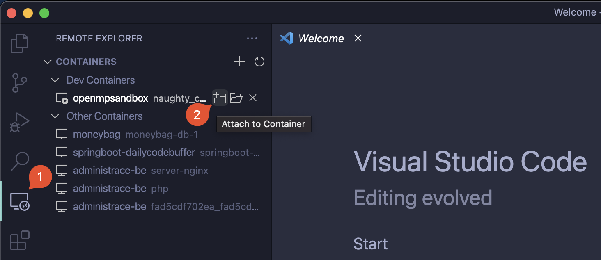
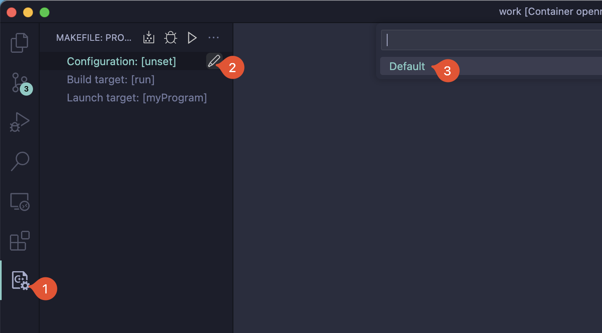
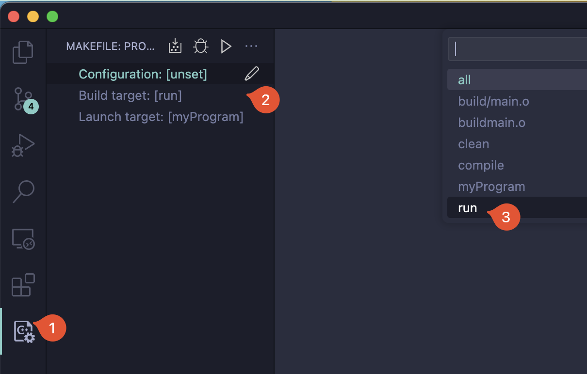
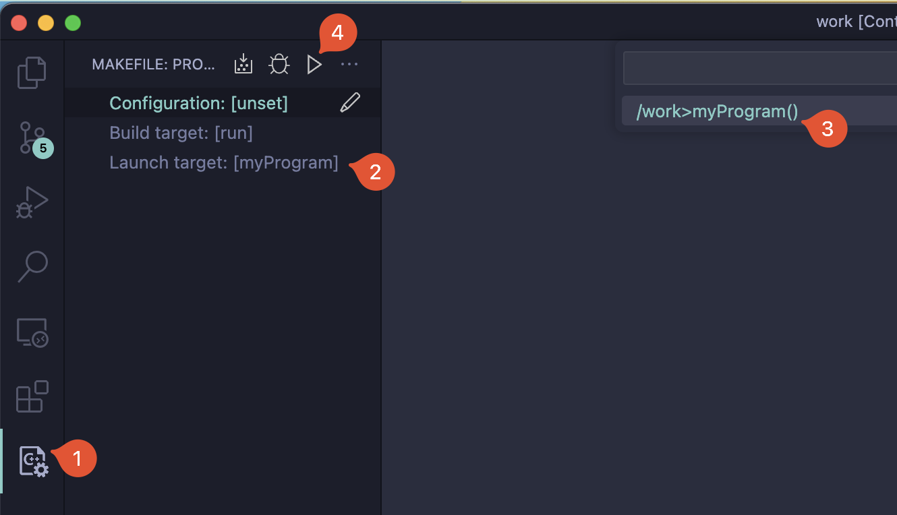

# Open MP sandbox

Sandbox for running C, C++ project with openMP dependency in docker.

## Get repository

```bash
git clone https://gitlab.fit.cvut.cz/babakjan/openmpsandbox.git
cd openmpsandbox
```

## Build container

```bash
docker build -t openmpsandbox .
```

## Run container

```bash
docker run -it -v `pwd`:/work openmpsandbox
```

## VS code setup (optional)

-   Install extension [Dev containers](https://marketplace.visualstudio.com/items?itemName=ms-vscode-remote.remote-containers)

-   Run remote development
    -   install extensions in Remote development [C, C++](https://marketplace.visualstudio.com/items?itemName=ms-vscode.cpptools), [makefile](https://marketplace.visualstudio.com/items?itemName=ms-vscode.makefile-tools)
    -   Open development environment
        
    -   Configuration
        
    -   Target
        
    -   Launch
        
